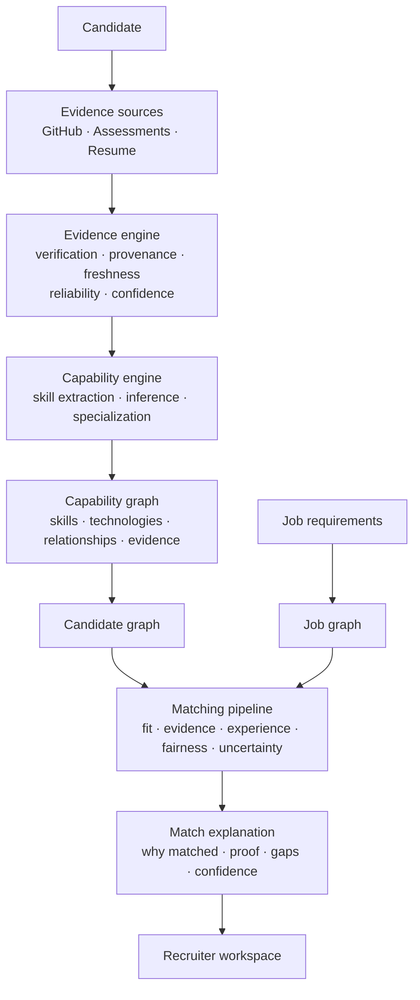

# ProofHire

ProofHire is an evidence-first hiring intelligence platform. It helps candidates demonstrate capability through verifiable work and gives recruiters an explainable way to search, compare, assess, and hire talent.

The product is deliberately not a résumé viewer or a single-score ranking tool. It converts source material—such as repositories, assessments, certifications, and résumés—into normalized evidence, capability graphs, and transparent job-match explanations.

## Architecture at a glance



ProofHire is organized as five cooperating layers:

| Layer | Responsibility |
| --- | --- |
| Experience | Candidate proof graph, recruiter workspace, and visual exploration |
| Intelligence | Matching, ranking, recommendations, search, and analytics |
| Capability | Skill graph, capability inference, and assessments |
| Proof | Evidence normalization, verification, provenance, and confidence |
| Infrastructure | Execution, workers, integrations, storage, and database operations |

## Product model

### Candidate experience: an interactive proof graph

A candidate profile is a capability graph, not a redesigned résumé. It connects capabilities (for example, Python, FastAPI, PostgreSQL, Docker, or AWS) to projects, assessments, certifications, and other supporting evidence.

Every important capability should answer: **Why does ProofHire believe this?** A recruiter can follow that trail to its underlying proof—such as repository activity, substantial contributions, merged pull requests, production projects, assessment results, and consistency over time.

### Recruiter experience: intelligence with evidence

Recruiters search for capabilities and constraints, then compare candidates by match, evidence strength, confidence, recency, and uncertainty. Opening a candidate reveals the match decomposition and a **View Proof** path back to the source evidence.

### Matching: a multidimensional, explainable result

Matching is not a single opaque percentage. The system retains the dimensions behind a final ranking:

- Capability fit: skills, graph similarity, and assessments
- Evidence fit: quality, reliability, and consistency of proof
- Experience fit: depth, recency, and complexity
- Context fit: eligibility, availability, location, and compensation where applicable
- Confidence and uncertainty: explicit measurement of what is known and unknown

The recruiter sees a clear result; the platform preserves the full explanation needed to inspect and reproduce it.

## Evidence-first pipeline

External provider data is ingested through a common adapter contract, then transformed before it is used in decisions:

```text
Source → External Account → Snapshot → Evidence → Skill Link
       → Capability → Candidate Graph → Match → Explanation
```

For example, a GitHub repository is not automatically proof of competence. ProofHire derives evidence from measurable signals such as contribution history, pull requests, code and language patterns, review activity, releases, project longevity, and project complexity.

## Execution model

Long-running and external workloads are planned and executed asynchronously so that a slow provider never blocks the product.

```text
Request → Intent → Execution Plan → Task Graph → Dependency Resolution
→ Parallel work (ingestion, parsing, assessments, extraction)
→ Evidence aggregation → Capability inference → Graph construction
→ Match computation → Explanation → Persist result → Publish events → Update UI
```

## Core invariants

These rules define the system boundaries and should be preserved as implementation begins:

1. Providers supply source data; they never directly decide final scores.
2. Raw provider data is normalized into evidence before it is used.
3. Important scores and scoring rules are versioned.
4. Important decisions, evidence, and AI-generated claims retain provenance.
5. Candidate ownership is verified before evidence is trusted.
6. Candidate evidence and recruiter notes are separate security domains.
7. Organization isolation is enforced on the server.
8. Every match includes an explanation, confidence, and uncertainty—not only a number.
9. Historical decisions remain reproducible.
10. Expensive work runs through the execution system.
11. Backend graph state is the source of truth; the UI only visualizes it.
12. Integrations implement shared provider contracts.
13. A résumé, GitHub contribution, or any individual source is evidence—not unquestioned truth.

## Repository layout

```text
proofhire/
├── backend/          FastAPI application, domain modules, workers, integrations, and tests
├── frontend/         React application, proof-graph UI, recruiter workspace, and tests
├── docs/             Product, architecture, API, security, and operations documentation
├── infrastructure/   Containers, database, cache, monitoring, deployment, and sandbox layouts
├── data/             Seed data, ontology definitions, and non-production samples
├── config/           Versioned application, scoring, matching, assessment, and provider settings
├── scripts/          Future environment, maintenance, data, and indexing utilities
├── security/         Threat model, controls, secret policy, and incident-response documentation
└── .github/          CI, security checks, issue templates, and pull-request workflow
```

The source tree is intentionally scaffolded only. Files are placeholders; no application, configuration, or deployment implementation has been added yet.

## Implementation sequence

Build the platform in dependency order while preserving the boundaries above:

1. Establish backend foundations: configuration, tenancy, authentication, persistence, audit logging, and contracts.
2. Implement provider contracts and the evidence model before provider-specific integrations.
3. Add the capability engine and graph construction on top of normalized evidence.
4. Build the asynchronous execution system and workers for expensive workloads.
5. Implement matching, scoring versioning, explanations, confidence, and fairness controls.
6. Deliver recruiter and candidate interfaces as views over the backend graph state.
7. Add analytics, reporting, subscriptions, and operational automation after the core decision flow is reliable.

## Status

**Architecture scaffold complete.** The repository currently contains the intended folder and file structure only. Implementation begins with the foundational modules described above.
